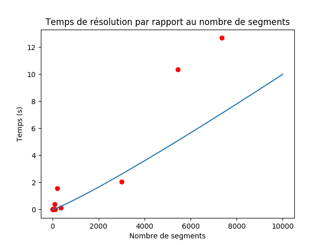

---
output:
  pdf_document: default
  html_document: default
---
----

## Rapport de projet : Bentley Ottmann

### Rigondaud Baptiste et Burrer Yann
#### 1A Ensimag, Avril 2017

----

#### Vue générale

Le projet Bentley Ottmann consiste en premier lieu à implémenter l'algorithme de Bentley Ottmann qui permet de calculer efficacement des intersections de segments dans un plan, en comparaison avec un algorithme "naïf" qui compare les segments deux à deux.

Dans la suite de ce rapport sont détaillés les choix techniques faits afin d'implémenter cet algorithme, une prise de performance sur des exemples fournis, une discussion autour de la compléxité de l'algorithme ainsi qu'un retour d'expérience.

L'objectif principal, qui est d'implémenter l'algorithme de Bentley Ottmann n'est cependant pas complètement atteint puisque certaines intersections ne sont pas calculées. Ce point sera plus longuement détaillé dans le retour d'expérience.

----

#### Rapport technique

###### Structures de données

- L'algorithme repose premièrement sur une gestion d'évènements, qui permettent, à l'aide d'une ligne de balayage virtuelle, de calculer les intersections. Afin de stocker ces évènements deux objets sont utilisés:

    - Event: représente un évènement
    - Events: contient la liste des évènements, qui est une SortedListWithKey, provenant du module SortedContainers.

- Cette liste des évènements permet de remplacer la structure d'arbre pour stocker les évènements, en utilisant pour clé les coordonnées de ceux-ci. Cette liste permet donc d'effectuer des opérations dichotomiques de recherche et d'insertion.

- Un point important de l'algorithme est la gestion des "segments en vie". Il représentent les segments pouvant effectuer une intersection. Afin de les stocker, nous avons utilisé une SortedList, du module SortedContainers, afin de remplacer une structure d'arbre. Cette structure est couplée avec une fonction de calcul de clé, qui est appelée à chaque opération sur la liste des segments vivants.

- Enfin, l'objet Solution permet en outre de stocker la solution (i.e. les intersections), mais permet aussi d'effectuer divers tracés. Cela permet notamment lors du débogage, de tracer l'algorithme étape par étape, en visualisant les segments en vie, le point courant, et les intersections au fur et à mesure de l'avancement de l'algorithme.

###### Prise de performance

Ci-dessous le graphe du temps de résolution sur les différents tests fournis:

La droite (en bleu) approche la compléxité théorique de l'algorithme en $O((n+k).log(n))$. En effet si n représente le nombre total d'évènements de création et fin de segments, et k le nombre d'intersections, puisque les structures de données utilisées permettent des opérations en $O(log(n))$, on obtient une compléxité en $O((n+k).log(n))$.

De plus sur des exemples complexes (le fichier carnifex_h_O5 fourni par exemple) avec de nombreux segments, l'exécution de l'algorithme naïf n'a pas beaucoup d'intérêt puisqu'il se termine en plusieurs minutes, contrairement à l'algorithme de Bentley Ottmann.

----

#### Rapport d'expérience

La recherche et la compréhension des structures de données utiles pour cet algorithme n'a pas été une difficulté pour ce projet. Cependant la première difficulté rencontrée a été une légère incompréhension sur les étapes de l'algorithme présentées lors du cours, plus précisément sur le mécanisme de retirer puis de résinsérer les segments lors d'une intersection afin de recalculer leurs clés pour les ordonner dans les segments vivants.

La deuxième diffcultée a été technique, plus précisément la production d'un code assez propre pour un débogage plus efficace. Plusieurs problèmes liés à un code pas assez clair ont été rencontrés, mais la création de l'objet Solution afin d'afficher les étapes de l'algorithme pas à pas a aidé à résoudre les principaux problèmes.

Cependant la résolution des problèmes n'est pas complète, car certains points d'intersection ne sont pas trouvés lors de l'exécution de notre programme. Ce qui implique l'utilisation d'un recherche naïve ainsi qu'une suppression naïve sur l'ensemble des segments vivants. L'algorithme n'est donc pas complétement optimal, quand bien même l'ensemble des segments vivants contient un nombre de segment fortement inférieur au nombre total de segments sur des exemples complexes fournis.
